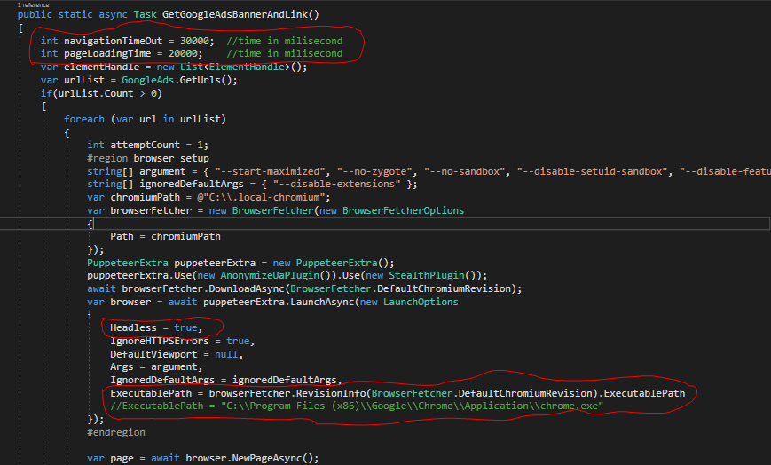
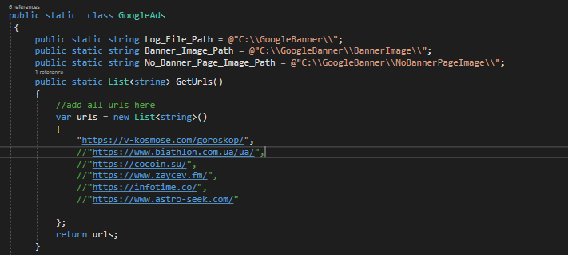

### Code Walkthrough

This  program has been written to extract the **Google Ads Banner and  its  Link** from the webpage if present.The library used was PuppeterSharp which let us simulate the real browser behaviour.It allows to send the request for any site in two different modes.
* Headless Mode : It lacks the GUI (Graphical User Interface) so user will not see the browser opening and making request to site.

* Normal Mode : It is the normal one like  we are using daily.We can see the browser opening, making request to site and its content.

### Settings 

Figure 1

In the above image (Figure 1), some of the code has been red circled and their value can be changed if needed.
* navigationTimeOut => By default, its value is 30 second. It means, it will wait 30 second for response from the requested site. If it get no response within 30 second, it throws TimeOut Error.

* pageLoadingTime => This is the time we keep waiting so that the web page and the Google Ads Banner loads properly if there is any.By default it is 20 second and you can change its value if needed.Value should be in MiliSecond.

* Headless = true/false  => If it is set to True , the browser works on headless mode and we can not see the browser. If it is in False state, the browser works like a normal browser so we can see everything.

   _Note: It is said that the functioning  when set to "Headless = true" and "Headless = false" is same.But during the test, in our particular case, I found that setting  "Headless = false" let Goolge Ads Banner appear more._

*  ExecutablePath => By default it launches the chromium browser But if you want to use Chrome instead, just comment the current line and uncomment the below one

### URls and Paths

Figure 2

You can see the path defined for Log, Banner Image and Page Image. You can change it here, if needed.
Similarly, you can add or remove the sites  as shown in the figure.

_Note: If it does not find any Google Ads Banners, the screenshot of whole page is taken and saved inside the folder "NoBannerPageImage". It helps us understand why Google Ads Banners are not captured._